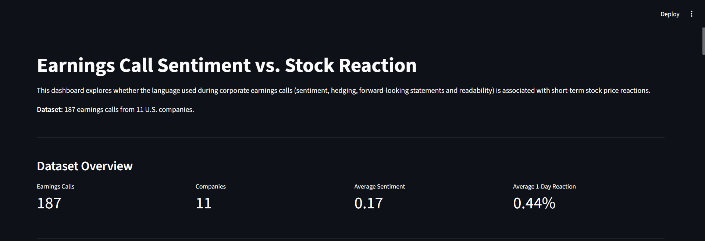

# Earnings Call Sentiment vs. Stock Reaction

An end-to-end financial NLP project that investigates whether the language used in corporate earnings calls influences short-term stock price reactions using Natural Language Processing (NLP), statistical analysis, and an interactive Streamlit dashboard.

---

## Dashboard Preview



---

## Project Overview

Corporate earnings calls provide valuable qualitative information about a company's financial performance and future outlook. While earnings surprises are known to influence stock prices, management's tone and language may also affect investor sentiment.

This project explores whether textual characteristics of earnings call transcripts—such as sentiment, hedging language, forward-looking statements, and readability—are associated with short-term stock price reactions after controlling for financial variables.

---

## Objectives

- Collect earnings call transcripts and financial data.
- Extract NLP-based language features from transcripts.
- Measure short-term stock price reactions.
- Analyze relationships using correlation and regression analysis.
- Build an interactive dashboard for visualization.

---

## Dataset

The final dataset contains:

- 187 earnings call transcripts
- 11 publicly traded U.S. companies
- Financial and NLP features extracted for each earnings call

Features include:

- Earnings surprise (%)
- 1-day stock reaction
- 3-day stock reaction
- Market reaction
- FinBERT sentiment score
- Hedging percentage
- Forward-looking statement percentage
- Readability score

---

## Project Workflow

1. Financial data collection using Yahoo Finance
2. Earnings transcript collection
3. Merge financial and transcript datasets
4. NLP feature extraction
   - FinBERT Sentiment
   - Hedging Language
   - Forward-Looking Statements
   - Readability
5. Correlation Analysis
6. Multiple Linear Regression
7. Interactive Streamlit Dashboard

---

## Technologies Used

- Python
- Pandas
- NumPy
- yfinance
- Transformers (FinBERT)
- TextStat
- Statsmodels
- Plotly
- Streamlit

---

## Repository Structure

```text
earnings-call-sentiment-analysis/
│
├── dashboard/
│   └── dashboard.py
│
├── notebooks/
│   └── 01_data_collection.ipynb
│
├── data/
│   └── final_dataset.csv
│
├── images/
│   └── dashboard.png
│
├── README.md
├── requirements.txt
└── .gitignore
```

---

## Key Findings

- Earnings surprise exhibited the strongest relationship with stock price reactions.
- Market movement also influenced post-earnings returns.
- Language-based features provided additional context but had weaker explanatory power after controlling for financial variables.
- The project demonstrates the integration of NLP techniques with financial analysis to study market behavior.

---
